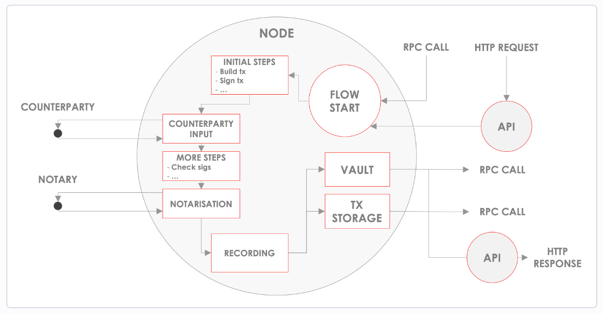
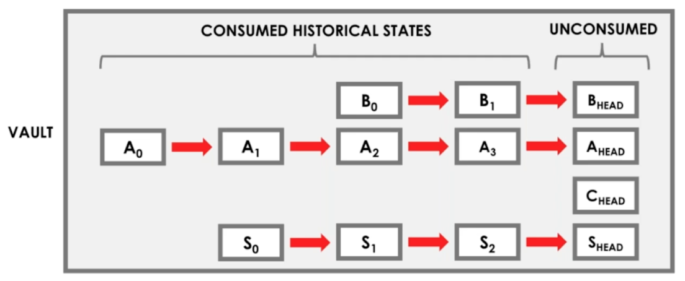
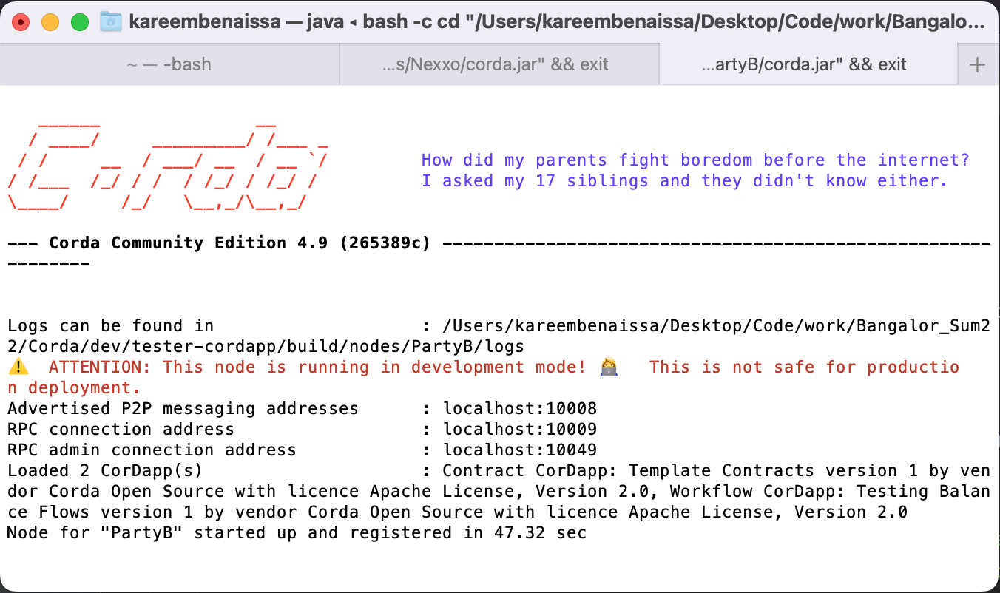

# Corda Blockchain Wallet
## Overview
This is a markdown documentation of a Blockchain wallet in Corda. There are 3 sections:
1. Explanation of Corda Blockchain
2. Wallet Documentation
3. Integration Examples 

The files referenced are part of folders called "tester-cordapp" and "java". The former is a *built* (see Integration) tester cordapp that contains a build folder for local development. The latter is a folder containing the specific flows, states, contract and client files that are used to build the CorDapp.

Note on accounts: Corda has support for accounts, which allows for multiple parties to be involved in separate ledgers on a single node, which is applicable to this project. Currently, this cordapp does not take advantage of party functionality on Corda.

## **Corda Blockchain**
___
 Corda is a *permissioned* blockchain. It was created to minimize extraneous delays that occur on public blockchains. In doing so, counterparty risk is minimized, and confidentiality is available. Consenus is reached on Corda by 
* Ensuring the validity of the transaction (defined by the smart contract)
* Ensuring the uniqueness of the transaction (done by a notary node)
***
### Corda Nodes and CorDapps

Corda provides an interface to connect with the blockchain through the use of CorDapps. A CorDapp is a distributed application that runs on the Corda network. CorDapps are installed on a node or cluster of nodes. Nodes on the network interact with other nodes on the network by participating in transactions. 



A Corda node permanently saves the transactions it participates in on a private/semi-private database, called the *vault*. A node's *ledger* refers to all of the most recent (unconsumed) transactions on the vault. 


***
### Transactions

Transactions are unitary, un - reducible actions to update the ledger. Transactions reference input states and return output states. Output states become the new head of the ledger list, and input states are marked historic or consumed.

There are 3 types of standard transactions:
1. Issuances - No input, creates the first state in sequence as output (or multiple output states).
2. Updates - input state reference and output or multiple outputs.
3. Exits - Input with no output.

Before a transaction updates the ledger, it must be signed by all parties involved.
A transaction is uncommitted when it has not yet been signed by all necessary peers involved. This is called a proposal. Proposals are signed by peers on a need-to-know basis, meaning only those involved will be asked to sign.
Any peer can propose a change to the ledger


A Corda nodes behavior during transactions is defined by the CordApp installed on it. A CordApp has three parts:
1. **State**     $X$
    - Defines the object that will be updated on the ledger. 
    - Similar to a class in Java.
    - Immutable; states cannot be changed, however they can be marked as consumed and moved from the ledger to the vault.
    - Implements the ContractState class from Corda. All ContractStates contain a list of participant parties. Any member of this list will store the state data on its ledger - so privacy is possible.
2. **Flow**       $T(X)$
    - Defines the procedures for updating the state variables of a transaction.
    - Similar to class functions. 
    - Builds the transaction to be verified by contract: Accepts 0 or many input states, returns 0 or many output states.
    - Automates processes like recording and signing transactions. Alters state in accordance with contract.
3. **Contract**  $V(T(X))$
    - Defines the rules for which a transaction can be deemed valid.
    - Without the contract, people can use the flows and states in any way they choose; the contract defines the way a state can change over time.
    - Accepts a transaction and returns whether or not the transaction is valid.

In summary, states are consumed or unconsumed linked objects that exist in the node's vault. A flow manages the updates to the states and builds a transaction. The contract specifies what makes a transaction valid for updating the ledger. States are shared across the ledgers of all *participants*. 


## **Wallet Documentation**
___
### Balance State
*/contracts/Balance.java*\
The balance state defines the variables needed to store and update a balance on the Corda blockchain. It implements the *LinearState* Corda class, and accordingly defines the *linearId* and *participants* variables. The *linaerId* is a *UniqueIdentifier* which identifies the uniqueness of the wallet. Note that the *balance* variable is not passable in the constructor - it is always equal to moneyIn - moneyOut.
```java
public class Balance implements LinearState {
    /**
     * Private variables:
     *      moneyIn, moneyOut, balance - doubles representing account balance.
     *      currency - String representing currency
     *      issuer - always this node.
     *      linearId - reperesents the user/owner of this balance.
     *                 linear id stays with the state as it changes over time.
     *      participants - required of all corda states. Will only include issuer.
     */
    private double moneyIn, moneyOut, balance;
    private String currency;
    private Party issuer;
    //implement LinearState
    private UniqueIdentifier linearID;

    private List<AbstractParty> participants;

    ...
    getters, setters, constructor, etc
    ...
```
The state's constructor is used by the flows to build new output states. The getters and setters are used by both the contract and flows to ensure the validity of the transaction as well as allow for extra flow functionality. 
***
### Flows

*/flows/IssueBalance.java*\
*/flows/Deposit.java*\
*/flows/Withdraw.java*\
There are three defined flows:
1. IssueBalance
2. Deposit
3. Withdraw
These flows give the procedures for updating the ledger in the case of issuance or update. Flows include an initiator class which initialize class variables to assist with building the transaction. In the case of IssueBalance, the initiator class looks like:
```java
public static class IssueBalanceInitiator extends FlowLogic<SignedTransaction>{
        /**
         * Flow Parameters
         *      - The only parameter needed to initate balance is currency
         *      - issuer is this node, balance is 0, and linearId is created within the flow.
         */
        private String initialCurrency;
        public IssueBalanceInitiator(String initialCurrency) { this.initialCurrency = initialCurrency; }

        ...
        call() function
        ...
```

This means that to call this flow, you would have to pass an initial currency as a parameter, which is then used to initalize a Balance output state (linearId is created and initialized to the output state within the flow).

In the case of Deposit and Withdraw, the initiator has the following parameters:
```java
        /**
         * Flow Parameters
         *      - The only parameters needed to deposit are amount and linearId.
         *      - issuer, currency, and moneyOut all stay the same.
         */
        private UniqueIdentifier balanceId; //tells us which account to deposit into
        private double amount;

```
To call these flows, you need to pass an amount to be deposited and a linearId representing the balance to deposit into. 

#### **call() function**
The initiator class also includes the call() function. This function returns a *SignedTransaction* which is committed to the ledgers of the parties in *participants*. This is the function in which the flow calls the state's constructor and builds the transaction from the input and output state. Here is an example of the Deposit call function:
```java
public SignedTransaction call() throws FlowException {
            /**
             * In transactions with multiple parties, we need a notary to reach consenus.
             * There are two methods
             *          1. Use the first Notary on the network
             *          2. Specify a notary to use
             * Second option is better for a non-test environment
             */
            final Party notary = getServiceHub().getNetworkMapCache().getNotaryIdentities().get(0); // METHOD 1
            //final Party notary = getServiceHub().getNetworkMapCache().getNotary(CordaX500Name.parse("O=Notary,L=London,C=GB")); // METHOD 2
            /**
             * QueryCriteria - query the vault by UniqueIdentifier for unconsumed state
             *               - this will give us the balance specified by the parameters, or originalBalance
             */
            String targetBalance = balanceId.toString();
            QueryCriteria.LinearStateQueryCriteria inputCriteria = new QueryCriteria.LinearStateQueryCriteria()
                    .withUuid(Arrays.asList(UUID.fromString(targetBalance)))
                    .withStatus(Vault.StateStatus.UNCONSUMED)
                    .withRelevancyStatus(Vault.RelevancyStatus.RELEVANT);
            /**
             * Input State - using inputCriteria, we retrieve the balance with the correct linearId
             *             - we want to consume this state and output a new state with the deposited balance.
             */
            StateAndRef balanceStateAndRef = getServiceHub().getVaultService().queryBy(Balance.class, inputCriteria).getStates().get(0);
            Balance originalBalance = (Balance) balanceStateAndRef.getState().getData();
            /**
             *  Output State - newMoneyIn should be oldMoneyIn plus this.amount
             *               - moneyOut, currency, issuer, linearId should all stay the same.
             */
            double newMoneyIn = originalBalance.getMoneyIn() + amount;
            Balance output = new Balance(newMoneyIn, originalBalance.getMoneyOut(),
                                        originalBalance.getCurrency(), originalBalance.getIssuer(),
                                        originalBalance.getLinearId());
            /**
             * Build Transaction - specify notary, input/output states, and corresponding contract command.
             *                   - command requires an owning key. we will use this node's (our) key.
             */
            TransactionBuilder txBuilder = new TransactionBuilder(notary)
                    .addInputState(balanceStateAndRef)
                    .addOutputState(output)
                    .addCommand(new BalanceContract.Commands.Deposit(),
                            this.getOurIdentity().getOwningKey());
            /**
             * Verify transaction
             */
            txBuilder.verify(getServiceHub());
            /**
             * Sign transaction
             */
            SignedTransaction sTx = getServiceHub().signInitialTransaction(txBuilder);
            /**
             * Notarise transaction and record states in ledger
             */
            return subFlow( new FinalityFlow(sTx, Collections.emptyList()) );
            /**
             * CordaDocs - FinalityFlow -
             *          Verifies the given transaction, then sends it to the named notary.
             *          If the notary agrees that the transaction is acceptable then
             *          it is from that point onwards committed to the ledger, and will be written through to the vault.
             *          Additionally it will be distributed to the parties reflected in the participants list of the states.
             */
        }
```

The flows can be called via http or RPC calls, which will be covered in section 3. 


***
### Balance Contract
*/contracts/BalanceContract.java*\
The balance contract asserts that the given transaction is valid. It implements the *Contract* class from Corda, and defines the *verify()* function. *verify()* is used by the flows to ensure a transaction is valid before committing it to the ledger - it accepts a *LedgerTransaction* tx and throws an exception if the transaction fails to meet the specified requirements. Assertions are given by Corda's *requireThat* function.

```java
public class BalanceContract implements Contract {

    /**
     * All contract instances implement the verify function
     * veryify is automatically called on a transaction when it is executed.
     */

    @Override
    public void verify(@NotNull LedgerTransaction tx) throws IllegalArgumentException {
        //Extract the command type from the transaction
        final CommandData commandType = tx.getCommands().get(0).getValue();
         /**
         * An Issue command should not use any input states, and should only create one output state (basic)
         * An issued balance must  be 0, currency must be specified (balance specific)
         */
        if (commandType instanceof BalanceContract.Commands.Issue) {
            Balance output = tx.outputsOfType(Balance.class).get(0);

            requireThat(require -> {
                //basic requirements
                require.using("No inputs should be consumed when issuing a new balance.", tx.getInputStates().size() == 0);
                require.using("Exactly one output should be created when issuing a new balance.", tx.getOutputStates().size() == 1);
                //balance specific
                require.using("Balance must be 0", output.getBalance() == 0);
                require.using("Currency must be specified", !output.getCurrency().equals(""));
                return null;
            });
        }

        /**
         * Deposit/Withdraw - only one field should be edited. all other variables should
         *                    be the same before and after transaction
         */
        else if (commandType instanceof BalanceContract.Commands.Deposit) {
            Balance input = tx.inputsOfType(Balance.class).get(0);
            Balance output = tx.outputsOfType(Balance.class).get(0);

            requireThat(require -> {
                //basic requirements
                require.using("Exactly one input should be consumed when issuing a new balance.", tx.getInputStates().size() == 1);
                require.using("Exactly one output should be created when issuing a new balance.", tx.getOutputStates().size() == 1);
                //operation specific
                require.using("only moneyIn changes", input.getMoneyOut() == output.getMoneyOut() &&
                        input.getCurrency() == output.getCurrency() &&
                        input.getIssuer() == output.getIssuer() &&
                        input.getLinearId() == output.getLinearId());
                return null;
            });
        }


    ...
    //more else statements + Command interface
    ...
```
## **Integration**
___
Corda used gradle to build test nodes for local development. In the "tester-cordapp" file, you can run 

```bash
./gradlew deployNodes
```
to build the testing cordapp. This will create the "build" folder and compile the state, contract and flows into a cordapp, which is then installed two test nodes: Nexxo and PartyB. You can see these nodes under /build/nodes. If you change directory into /build/nodes and run

```bash
./runnodes
```

This will run the nodes and allow for interaction via the interactive terminal. It will open a terminal window like this:



The RPC address and http address ports are shown.
***
### Clients
*/client/Client.java*\
*/clients/webserver/Controller.java*\
The Corda interface allows for interaction via RPC and http calls. The client folder has some basic examples for how to call flows. Using the RPC import from Corda, and SpringBoot REST APIs, we can call flows when the node is running. Below is an example for issuing a balance with RPC, seen in the "Client.java" file:

```java
package com.template;

import net.corda.client.rpc.CordaRPCClient;
import net.corda.client.rpc.CordaRPCConnection;

...

/**
 * Connects to a Corda node via RPC and performs RPC operations on the node.
 *
 * The RPC connection is configured using command line arguments.
 */
public class Client {
    private static final String RPC_USERNAME = "user1";
    private static final String RPC_PASSWORD = "test";

    public static void main(String[] args) {
        if (args.length != 2) throw new IllegalArgumentException("Usage: RpcClient <node address> <counterpartyName>");
        System.out.println(args[0]);
        System.out.println(args[1]);

        final String rpcAddressString = args[0];
        final String currency = args[1];

        final RPCClient rpcClient = new RPCClient(rpcAddressString);
        rpcClient.issue_balance(currency);
        rpcClient.closeRpcConnection();

    }

    ...

        private void issue_balance(String currency) {
            try {
                //start flow using proxy RPC connection
                SignedTransaction result = proxy.startFlow(IssueBalance.IssueBalanceInitiator.class, currency).getReturnValue().get();

                return ResponseEntity
                        .status(HttpStatus.CREATED)
                        .body("Transaction id "+ result.getId() +" committed to ledger.\n "
                                + "BalanceId is " + result.getTx().getOutput(0).getLinearId() + "\n"
                                + "Balance currency is " + result.getTx().getOutput(0).getCurrency());
            } catch (Exception e) {
                return ResponseEntity
                        .status(HttpStatus.BAD_REQUEST)
                        .body(e.getMessage());
            }
        }
    }
}
```

Corda also gives examples for using REST APIs with SpringBoot, as seen in the "Controller.java" file:

```java
   /**
     *
     * @param request - needs a initialCurrency parameter
     * @return Custom Response
     * @throws IllegalArgumentException
     */
    @PostMapping (value = "create-balance" , produces =  TEXT_PLAIN_VALUE , headers =  "Content-Type=application/x-www-form-urlencoded" )
    public ResponseEntity<String> issueBalance(HttpServletRequest request) throws IllegalArgumentException {
        // Get currency value from request
        String currency = request.getParameter("initialCurrency");
        try {
            //start flow using proxy RPC connection
            SignedTransaction result = proxy.startFlow(IssueBalance.IssueBalanceInitiator.class, currency).getReturnValue().get();

            return ResponseEntity
                    .status(HttpStatus.CREATED)
                    .body("Transaction id "+ result.getId() +" committed to ledger.\n "
                            + "BalanceId is " + result.getTx().getOutput(0).getLinearId() + "\n"
                            + "Balance currency is " + result.getTx().getOutput(0).getCurrency());
        } catch (Exception e) {
            return ResponseEntity
                    .status(HttpStatus.BAD_REQUEST)
                    .body(e.getMessage());
        }
    }
```

Using the client and/or another running program, you can start flows and query data from the ledger using these methods.
